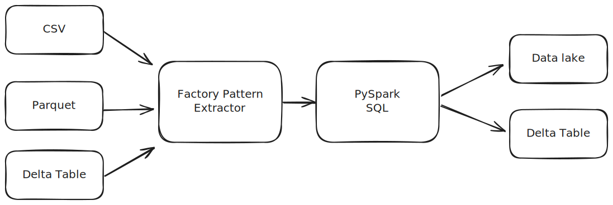

# ETL Pipeline on E-Commerce business

## Project Overview
This project involves the development of an ETL pipeline for an E-Commerce business on Databricks. The implementation follows the Factory Pattern to ensure modularity and scalability.

## Architecture




## Features
* **Data Extraction:** Extracts data from multiple sources, including CSV, Parquet, and Delta tables.
* **Data Transformation:** Implements transformation logic and optimization techniques to enhance pipeline performance.
* **Data Storage:** Stores transformed data in Data Lake and Delta tables for efficient querying and analytics.
* **Performance Optimization:** Applied advanced optimization techniques, improving pipeline efficiency by 99%.

## Project Structure
```
project_root/
│-- src/             # Contains all source code files
│-- data/            # Stores raw and processed data
│-- README.md        # Project documentation
```

## Technologies Used
* **Databricks** for cloud-based data processing
* **Apache Spark** for distributed data transformations
* **Delta Lake** for optimized storage and versioning
* **Factory Pattern** for modular and reusable ETL components

## Setup Instructions
1. Clone the repository:
   ```
   git clone <repository_url>
   cd project_root
   ```

## Contributing
Feel free to submit issues and pull requests to improve this ETL pipeline.